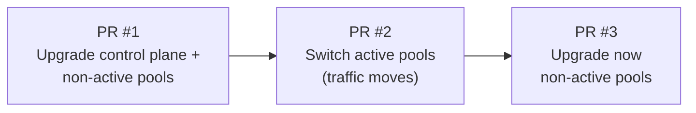

# GKE upgrade tool

> Automates GKE version upgrades in KBC stack `infrastructure.tfvars` files using a blue-green (A/B) node pool strategy.

## Table of Contents

- [Overview](#overview)
- [How the A/B upgrade works](#how-the-ab-upgrade-works)
- [Requirements](#requirements)
- [Installation](#installation)
- [Usage](#usage)
  - [Local](#local)
  - [Docker](#docker)
  - [GitHub Actions](#github-actions)
- [CLI reference](#cli-reference)
- [Example output](#example-output)
- [Recovery](#recovery)
- [Releasing](#releasing)

## Overview

This tool dynamically discovers all node pool types from the config file — no hardcoded pool names. New pool types are picked up automatically.

What it does:

- Fetches latest GKE versions from the *no-channel* [release feed](https://cloud.google.com/kubernetes-engine/docs/release-notes-nochannel)
- Upgrades the control plane and non-active nodepools to the target version
- Allows switching active/non-active nodepools separately with `--switch-active-only`
- Idempotent — only updates what is needed
- Provides colorized, sectioned CLI output

## How the A/B upgrade works

The GitHub Action creates **3 sequential PRs** per stack:



| Step | What happens | Risk |
|------|-------------|------|
| **PR #1** | Control plane + non-active pools upgraded to new version | None — traffic still on old pools |
| **PR #2** | Active/non-active flags flipped — traffic moves to upgraded pools | Rollback: run `--switch-active-only` again |
| **PR #3** | Previously active pools (now non-active) upgraded | None — no traffic on these pools |

Each PR is based on the previous one's branch, giving a safe, reviewable, step-by-step upgrade path.

## Requirements

- Python 3.12+
- [uv](https://docs.astral.sh/uv/) (recommended) or pip

## Installation

### Local (with uv)

```bash
# From a release tarball
uv tool install gke_upgrade_tool-*.tar.gz

# Or from source
git clone https://github.com/keboola/gke-upgrade-tool.git
cd gke-upgrade-tool
uv sync
uv run gke-upgrade-tool --help
```

### Docker

```bash
docker run --rm \
  -v /path/to/infrastructure.tfvars:/app/infrastructure.tfvars \
  ghcr.io/keboola/gke-upgrade-tool:latest /app/infrastructure.tfvars
```

## Usage

### Local

```bash
# Auto-detect minor version, use second-to-latest build
gke-upgrade-tool <stack>/infrastructure.tfvars

# Specify minor version
gke-upgrade-tool <stack>/infrastructure.tfvars -m 1.33

# Use the latest build for a minor version
gke-upgrade-tool <stack>/infrastructure.tfvars -m 1.33 -l

# Use a specific build version
gke-upgrade-tool <stack>/infrastructure.tfvars -i 1.33.5-gke.1162000

# Switch active/non-active nodepools only
gke-upgrade-tool <stack>/infrastructure.tfvars --switch-active-only
```

### Docker

```bash
docker run --rm \
  -v $(pwd)/<stack>/infrastructure.tfvars:/app/infrastructure.tfvars \
  ghcr.io/keboola/gke-upgrade-tool:latest /app/infrastructure.tfvars -m 1.33
```

### GitHub Actions

<details>
<summary>Minimal example</summary>

```yaml
- uses: "keboola/gke-upgrade-tool@v0.1.0"
  with:
    kbc-stack: "dev-keboola-gcp-us-central1"
```

</details>

<details>
<summary>Full example (workflow)</summary>

```yaml
name: Check and upgrade the GKE version

on:
  workflow_dispatch:
    inputs:
      kbc-stack:
        description: "KBC stack to upgrade, leave empty to upgrade all stacks"
        required: true
        type: string
      gke-minor-version:
        description: "GKE minor version to upgrade to, leave empty to auto-detect"
        required: false
        type: string
      use-latest:
        description: "Use the latest GKE version (default: second-to-latest)"
        required: false
        type: boolean
      specific-version:
        description: "Specific GKE version to upgrade to (e.g. 1.33.5-gke.1162000)"
        required: false
        type: string
      jira-ticket:
        description: "Related JIRA ticket"
        required: false
        type: string

permissions:
  contents: write
  pull-requests: write

env:
  GH_TOKEN: ${{ github.token }}

jobs:
  upgrade-gke-cluster:
    runs-on: ubuntu-latest
    steps:
      - name: Checkout
        uses: actions/checkout@v6
      - uses: "keboola/gke-upgrade-tool@v0.1.0"
        with:
          kbc-stack: ${{ inputs.kbc-stack }}
          gke-minor-version: ${{ inputs.gke-minor-version }}
          use-latest: ${{ inputs.use-latest }}
          specific-version: ${{ inputs.specific-version }}
          jira-ticket: ${{ inputs.jira-ticket }}
```

</details>

## CLI reference

```
usage: gke-upgrade-tool [-h] [-i IMAGE] [-m MINOR] [-l] [--switch-active-only] config_file

Upgrade GKE version in infrastructure.tfvars

positional arguments:
  config_file           Path to infrastructure.tfvars file

options:
  -h, --help            show this help message and exit
  -i, --image IMAGE     Use specific GKE build version (e.g. 1.33.5-gke.1162000)
  -m, --minor MINOR     GKE minor version to upgrade to (e.g. 1.33)
  -l, --latest          Use the latest build for the target minor version
  --switch-active-only  Switch active nodepools only, do not change any version fields
```

> [!NOTE]
> `-m`/`-l` and `-i` are mutually exclusive.

## Example output

### Upgrading non-active pools

```console
$ gke-upgrade-tool my-stack/infrastructure.tfvars -m 1.33

🔎 Highest GKE version in file is: 1.33.4-gke.1000000
🎉 Second to latest GKE version for minor version 1.33 is: 1.33.9-gke.1060000

=== GKE Control Plane ===
✅ Upgraded to 1.33.9-gke.1060000

=== Nodepools ===
main:
  • Active: b (version: 1.33.4-gke.1000000)
  • Non-active: a (version: 1.33.4-gke.1000000)
  ✅ Upgraded non-active pool 'a' to 1.33.9-gke.1060000
eck:
  • Active: b (version: 1.33.4-gke.1000000)
  • Non-active: a (version: 1.33.4-gke.1000000)
  ✅ Upgraded non-active pool 'a' to 1.33.9-gke.1060000
...

✔️ Control plane and non-active nodepools upgraded.
```

### Switching active pools

```console
$ gke-upgrade-tool my-stack/infrastructure.tfvars --switch-active-only

=== Switching Active Nodepools ===
🔄 node_pool_main_active: b -> a
🔄 node_pool_eck_active: b -> a
🔄 node_pool_job_queue_jobs_active: b -> a
...
🔄 All active nodepool flags switched.
✅ Switched active nodepools only. Exiting.
```

### Already up-to-date

```console
$ gke-upgrade-tool my-stack/infrastructure.tfvars -m 1.33

🔎 Highest GKE version in file is: 1.33.9-gke.1060000
🎉 Second to latest GKE version for minor version 1.33 is: 1.33.9-gke.1060000

=== GKE Control Plane ===
🫡 Already at 1.33.9-gke.1060000

=== Nodepools ===
main:
  🫡 Non-active pool 'a' already at 1.33.9-gke.1060000
...

🫡 Everything is already up-to-date. Nothing to do.
```

## Recovery

> [!TIP]
> The tool is idempotent — re-running it will pick up where it left off.

- Each PR is independent — you can merge or revert individual phases
- To undo a pool switch: run `--switch-active-only` again (it toggles a↔b)
- If the Google feed is temporarily unavailable: use `-i` with a known version to bypass the feed

## Releasing

Releases are driven by git tags. Pushing a tag matching `v*` triggers [`.github/workflows/main.yaml`](.github/workflows/main.yaml), which:

1. Builds the Python package and attaches the tarball to a new GitHub Release (auto-generated notes).
2. Builds and pushes a multi-arch Docker image to `ghcr.io/keboola/gke-upgrade-tool` tagged with the version (e.g. `v0.1.2`).

The composite `action.yaml` pulls the Docker image using `${{ github.action_ref }}`, so the image tag always matches the ref the caller pins (`keboola/gke-upgrade-tool@v0.1.2` → `ghcr.io/keboola/gke-upgrade-tool:v0.1.2`). No manual version sync in `action.yaml` is needed.

### Cutting a release

1. Merge all changes to `main`.
2. Create and push an annotated tag:

    ```bash
    git checkout main && git pull
    git tag -a v0.1.3 -m "v0.1.3"
    git push origin v0.1.3
    ```

3. Wait for the `Build and Publish` workflow to finish — verify the [release](https://github.com/keboola/gke-upgrade-tool/releases) and the matching [Docker image](https://github.com/keboola/gke-upgrade-tool/pkgs/container/gke-upgrade-tool) tag exist.
4. Bump consumers (e.g. `keboola/kbc-stacks`) to the new `keboola/gke-upgrade-tool@vX.Y.Z` ref.
